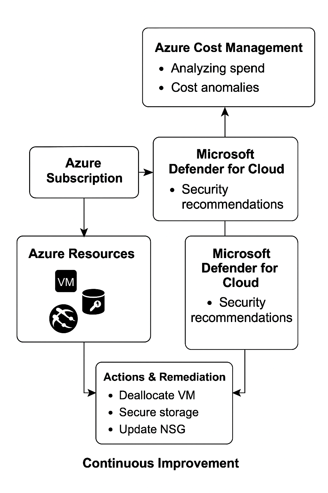

## Azure Governance: Cost Management & Security Recommendations Lab

As part of my hands-on Azure cloud security portfolio, this lab demonstrates the intersection of cost governance and security using **Azure Cost Management** and **Microsoft Defender for Cloud**.  
I analyzed spend, identified security recommendations and remediated gaps—showcasing cloud efficiency and proactive risk management.

---

## Table of Contents

- [Overview](#overview)
- [Real-World Risk](#real-world-risk)
- [What I Built](#what-i-built)
- [Diagram](#diagram)
- [Objectives](#objectives)
- [Steps Performed](#steps-performed)
  - [1. Resource Group Setup]
  - [2. Cost Management Analysis]
  - [3. Security Recommendations Review]
  - [4. Remediation: Defender CSPM]
  - [5. Cleanup]
- [Screenshots](#screenshots)
- [Lessons Learned](#lessons-learned)
- [Notes and Considerations](#notes-and-considerations)
- [References](#references)
- [Contact](#contact)

---

## Overview

This lab demonstrates the ability to analyze Azure spend and continuously improve cloud security using Microsoft Defender for Cloud. I created demo resources, analyzed cost drivers and remediated security posture recommendations to show how technical and financial operations go hand-in-hand in the cloud.

---

## Real-World Risk

- Unmonitored cloud resources can drive up costs and introduce security vulnerabilities.
- Security teams must balance operational security **and** cost-effectiveness to support business goals.
- Continuous monitoring and remediation reduce both unnecessary spend and cyber risk.

---

## What I Built

- Deployed a resource group, virtual machine and storage account to simulate a real cloud environment.
- Used **Azure Cost Management** to analyze cloud spend and identify resource cost drivers.
- Investigated **Microsoft Defender for Cloud** recommendations and prioritized remediation.
- Enabled **Defender CSPM** to strengthen posture management.
- Cleaned up resources to demonstrate cost responsibility.

---

## Diagram

---

## Objectives

- Demonstrate end-to-end Azure cost analysis and security improvement.
- Show ability to remediate actionable recommendations in Microsoft Defender for Cloud.
- Prove responsible cloud use by cleaning up resources post-lab.

---

## Steps Performed

**1. Resource Group Setup**  
   - Created resource group `rg-lab11-portfolio` to host all lab resources.  
   - Confirmed creation and readiness before deploying services *(Screenshot: `resource-group.png`)*

**2. Resource Deployment**  
   - Deployed a Virtual Machine (`vm-lab11-demo`) with public IP to simulate typical cloud spend and security signals.  
   - Created a Storage Account (`stlab11demo`) for demonstrating storage cost and security.  
   - Documented resource overviews for both deployments *(Screenshots: `vm-overview.png` & `storage-overview.png`)*

**3. Cost Management Analysis**  
   - Navigated to `Cost Management > Cost Analysis` in Azure Portal.  
   - Filtered costs by resource group to analyze lab spend and cost drivers.  
   - Captured dashboard for documentation *(Screenshot: `cost-dashboard-initial.png`)*

**4. Security Recommendations Review**  
   - Opened `Defender for Cloud > Recommendations` to review current security posture.  
   - Identified actionable recommendations, prioritizing “Microsoft Defender CSPM should be enabled.” *(Screenshot: `defender-recommendations-initial.png`)*
   - Documented recommendation state before remediation *(Screenshot: `defender-cspm-before.png`)*

**5. Remediation: Enable Defender CSPM**  
   - Enabled `Microsoft Defender Cloud Security Posture Management (CSPM)` via Environment Settings in Defender for Cloud.  
   - Verified the plan is active and monitored coverage status.  
   - Documented proof of remediation *(Screenshot: `defender-cspm-enabled.png`)*

**6. Cleanup**  
   - Deleted resource group `rg-lab11-portfolio` to remove all lab resources and avoid unnecessary cloud spend.  
   - Confirmed deletion to demonstrate responsible cloud usage.

---

## Screenshots

*All screenshots are included in the `screenshots/` folder.*

| Step | Filename                             | Description                                 |
|------|--------------------------------------|---------------------------------------------|
| 1    | resource-group.png                   | Resource group overview after creation      |
| 2    | vm-overview.png                      | Virtual machine overview after deployment   |
| 2    | storage-overview.png                 | Storage account overview after deployment   |
| 3    | cost-dashboard-initial.png           | Cost Management dashboard, filtered by RG   |
| 4    | defender-recommendations-initial.png | Initial Defender for Cloud recommendations  |
| 4    | defender-cspm-before.png             | CSPM recommendation before remediation      |
| 5    | defender-cspm-enabled.png            | CSPM enabled—remediation complete           |

---

## Lessons Learned

- Cost management and security posture improvement go hand-in-hand in Azure.
- Proactive remediation of recommendations leads to stronger, more cost-efficient environments.
- Cleaning up lab resources is a critical step for responsible cloud use.

---

## Notes and Considerations

- Defender for Cloud recommendations may take time to update after remediation.
- Costs are redacted in screenshots for privacy; process and governance ability are demonstrated.
- This lab can be repeated regularly for ongoing improvement.

---

## References

- [Azure Cost Management](https://learn.microsoft.com/en-us/azure/cost-management-billing/)
- [Microsoft Defender for Cloud](https://learn.microsoft.com/en-us/azure/defender-for-cloud/)
- [Azure Resource Cleanup](https://learn.microsoft.com/en-us/azure/azure-resource-manager/management/delete-resource-group?tabs=azure-portal)

---

## Contact

Sebastian Silva C. – July, 2025 – Berlin, Germany.  
[LinkedIn](https://www.linkedin.com/in/sebastiansilc) | [GitHub](https://github.com/SebaSilC) | [sebastian@playbookvisualarts.com](mailto:sebastian@playbookvisualarts.com)

